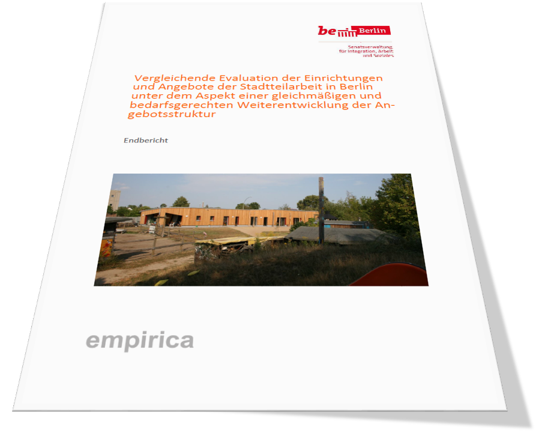

# Richtwerte für Stadtteilzentren – ein neues Planungsinstrument für soziale Infrastruktur

Soziale Infrastruktur – wie Kitas, Bibliotheken, Jugendfreizeiteinrichtungen oder eben Stadtteilzentren – braucht eine verlässliche Grundlage, um im Zuge von Stadtentwicklung und Bevölkerungswachstum mitgeplant werden zu können. Während für Bildungseinrichtungen seit Jahren verbindliche Gesetze und feste Maßzahlen existieren, fehlte bislang eine vergleichbare Planungsgrundlage für die Stadtteilarbeit.

Mit dem Senatsbeschluss der quantitativen Planungs- und Orientierungsrichtwerte für Einrichtungen der Stadtteilarbeit im September 2023 wurde nun ein verbindliches Instrument geschaffen, das Klarheit hinsichtlich der Bedarfe schafft und den Bezirken Orientierung bei der Sozialen Infrastrukturplanung im Rahmen der Sozialen Infrastrukturkonzepte (SIKo) gibt. Damit sollen die räumlichen Bedürfnisse der Stadtteilzentren künftig besser in Stadtentwicklungsprozesse integriert werden.

> Weiterführende Links zum Richtwert-Beschluss:

> * [Pressemitteilung zum Senatsbeschluss der quantitativen Planungs- und Orientierungsrichtwerte für Einrichtungen der Stadtteilarbeit](https://www.berlin.de/rbmskzl/aktuelles/pressemitteilungen/2023/pressemitteilung.1364701.php)
> * [Mitteilung – zur Kenntnisnahme –
Stärkung der Stadtteilzentren als generationsübergreifende Begegnungsorte im Kiez Drucksachen 19/1450 und 19/1604 – Abschlussbericht](https://www.parlament-berlin.de/ados/19/IIIPlen/vorgang/d19-2419.pdf)
> * [Beschlussempfehlung des Ausschusses für Arbeit und Soziales vom 11. April 2024 zum Antrag der Fraktion der CDU und der Fraktion der SPD: Stadtteilzentren als generationsübergreifende Begegnungsorte im Kiez stärken](https://www.parlament-berlin.de/ados/19/IIIPlen/vorgang/d19-1604.pdf)

Der Beschluss hebt die Bedeutung der Stadtteilzentren als Orte der Begegnung, Beratung und Teilhabe hervor und hilft, sie dauerhaft in der Infrastrukturplanung zu verankern. In Folge ist der Fachbereich nun auch in den Gremien zur Berliner Sozialen-Infrastrukturplanung (SIKo/SoFIS-Austauschs, [SIIP](https://www.berlin.de/sen/stadtentwicklung/planung/planungskoordination-soziale-infrastruktur/strategie-zur-integrierten-infrastrukturplanung-siip/)) vertreten – eine Reihe von Abstimmungsformaten, in dem die Bezirke gemeinsam mit den beteiligten Senatsverwaltungen die Grundlagen der Sozialen Infrastrukturplanung diskutieren und weiterentwickeln. Der Fachbereich Infrastrukturförderprogramm Stadtteilzentren ist damit nun auch aktiv in die Fortschreibung der Sozialen Infrastruktur-Konzepte (SIKo) eingebunden. Diese Konzepte dienen der vorausschauenden Planung und Sicherstellung der sozialen Infrastruktur in Berlin. Dabei werden aktuelle Daten genutzt, um die Versorgung mit sozialen Einrichtungen wie Stadtteilzentren, Kitas und Bibliotheken zu bewerten und zu planen. Ein zentrales Instrument hierfür ist das [Soziale Infrastruktur-Flächeninformationssystem (SoFIS)](https://prisma.senstadt.verwalt-berlin.de/ip_prisma/Configurator?scenario=IPSI_mip#app/startpage), das als Daten- und Planungsgrundlage dient. Der Fachbereich beteiligt sich aktiv an der Weiterentwicklung und der Bereitstellung der Stadtteilzentren Daten an SoFIS, um eine bedarfsgerechte und zukunftsfähige Infrastrukturplanung zu gewährleisten.

Zur Vorbereitung der Richtwerte beauftragte der Fachbereich Infrastrukturförderprogramm Stadtteilzentren eine Studie, die ein Benchmarking zwischen Berlin und anderen Städten vornahm und die Versorgungslage der Stadtteilzentren und weiterer Nachbarschaftseinrichtungen in Berlin untersuchte. Ergebnis dieser Analyse war ein Flächenrichtwert von mindestens 10 m² Nutzfläche pro 1.000 Einwohner auf Ebene der Bezirksregionen (BZR) sowie die Vorgabe, dass in jedem der 58 Prognoseräume (PGR) mindestens ein Stadtteilzentrum bestehen soll.

<figure markdown="span">
{ width="400" }
<figcaption>Beauftragte Studie als Vorbereitung auf den Richtwert</figcaption>
</figure>

> Prognoseräume und Bezirksregionen gehören zu den [Lebensweltlich orientierten Räumen (LOR)](https://www.berlin.de/sen/sbw/stadtdaten/stadtwissen/sozialraumorientierte-planungsgrundlagen/lebensweltlich-orientierte-raeume/). Die LORs bilden die “räumliche Grundlage für Planung, Prognose und Beobachtung demografischer und sozialer Entwicklungen in Berlin” (ebd.) ab. Es gibt:

>* **Prognoseräumen (PGR)** als obere Ebene, **58 Räume**,
>
* **Bezirksregionen (BZR)** als mittlere Ebene, **143 Räume**,
* **Planungsräumen (PLR)** als unterste Ebene, **542 Räume**.

Je nach Gegebenheiten in der Bezirksregion erhöhen sich die Richtwerte:

* **12 m²** Nutzfläche, wenn ein **Stadtteilzentrum** in der Bezirksregion liegt,
* **13 m²** Nutzfläche, wenn die Bezirksregion sich mit einem Wirkraum der **Ressortübergreifenden Gemeinschaftsinitiative (GI)** überschneidet,
* **15 m²** Nutzfläche, wenn beide Bedingungen zusammentreffen (**Stadtteilzentrum und GI-Wirkraum**).

Damit ergeben sich differenzierte Vorgaben zwischen **10 und 15 m² pro 1.000 Einwohner je Bezirksregion**. Welche Bezirksregionen wie konkret zu versorgen sind, wird im Rahmen der Umsetzung der Richtwerte noch detailliert erarbeitet.

> Formel:
Nutzfläche für Stadtteilzentren in m² pro BZR = (Einwohneranzahl in der BZR / 1.000) × X
>
> BZR: Bezirksregion
> GI: Ressortübergreifenden Gemeinschaftsinitiative
> X:
>
> * wenn: kein Stadtteilzentrum und keine GI:     X = 10 m²
> * wenn: Stadtteilzentrum und keine GI:          X = 12 m²
> * wenn: kein Stadtteilzentrum und mit GI:       X = 13 m²
> * wenn: Stadtteilzentrum und mit GI:            X = 15 m²

Mit diesen Vorgaben verfügt Berlin erstmals über eine verlässliche Planungsbasis für die Stadtteilarbeit – vergleichbar mit den Standards, die für Bibliotheken oder Jugendfreizeiteinrichtungen längst etabliert sind. Die Richtwerte stellen sicher, dass Stadtteilzentren künftig als grundlegende Bausteine sozialer Infrastruktur anerkannt und in der wachsenden Stadt vorausschauend berücksichtigt werden.

> Weiterführende Links:
>
> * <https://www.tagesspiegel.de/berlin/bei-entwicklung-neuer-quartiere-in-berlin-stadtteilzentren-sollen-verpflichtend-mitgeplant-werden-11317738.html>
